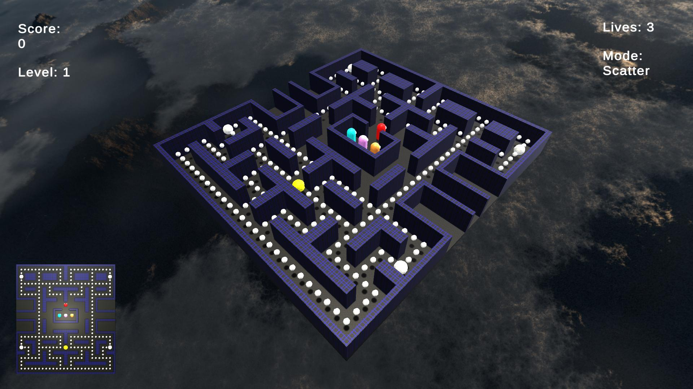

# pcmn3d

## Overview

This is a 3D remake of the classic arcade game Pacman using Unity, all built during my work placement at [ise](https://www.ise.de/). As this is my first (and probably only) Unity project, the code quality might not be on par with my other projects and it's very likely I didn't follow all (or even most) best practices of this toolset. Also note that this remake doesn't even nearly implement all the rules and mechanics of the original game, which despite its age is still a really advanced and intricate master piece. For the rules and mechanics it implements, I tries to be as close to the original as possible though.

## Dependencies

I generally try to minimize dependencies, but I'm a one man crew and can therefore only support Windows 10 as I ran that during development. Anyway, you need to have the following packages installed for everything to work properly:

- Unity 2022.3.4f1 as the game engine. Install it via the [installation guide](https://docs.unity3d.com/2022.3/Documentation/Manual/GettingStartedInstallingUnity.html).
- Visual Studio 2022 Community as the code editor. Install it via the [website](https://visualstudio.microsoft.com/de/vs/community/).

## How to run it

Import this repo into a Unity 2022.3.4f1 instance, open the scene `Game` from the `Project` explorer and run it from there or simply take a look at the [Releases](https://github.com/locxter/pcmn3d/releases) section.

## How to play it

The goal of the game is rather simple - eat all white spheres (referred to as pellets) to gain points and ultimately get to a higher level. This task is made difficult by the four ghosts, who are repeatedly chasing you with different personalities, but they can also be exploited for even higher scores. Once you eat one of the four bigger spheres (referred to as power pellets), the game mode changes and suddenly Pacman is able to eat the ghosts for a limited amount of time. This risk is rewarded with large amounts of points and can be the key for achieving the new high score, which is stored across sessions. Control is also rather basic - move around with your WASD or arrow keys and change your field of view with the mouse - that's it, have fun!

## Credits

All Pacman related credits and copyright goes to Namco and its local distributors. The nice music is from [classicgaming.cc](https://www.classicgaming.cc/classics/pac-man/sounds) and the amazing skybox is courtesy of [Avionx](https://assetstore.unity.com/packages/2d/textures-materials/sky/skybox-series-free-103633). Also a huge shout-out to [GameInternals](https://gameinternals.com/understanding-pac-man-ghost-behavior) and [The Pac-Man Dossier](https://pacman.holenet.info/) for great explanations of the game's rules and mechanics.
